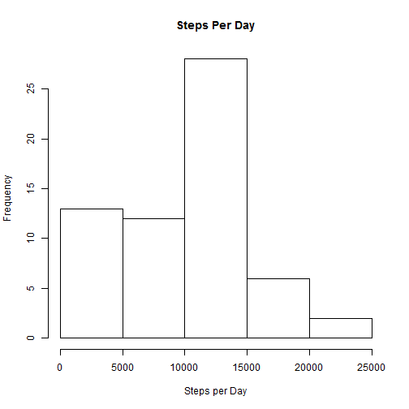
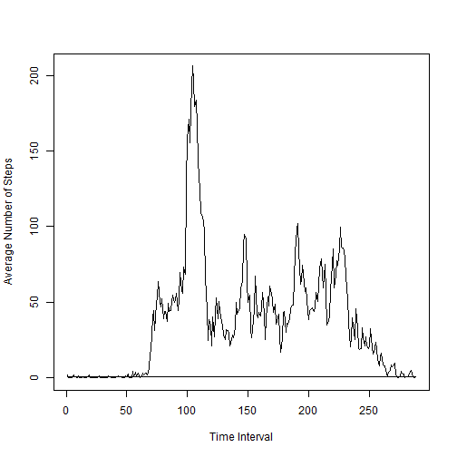
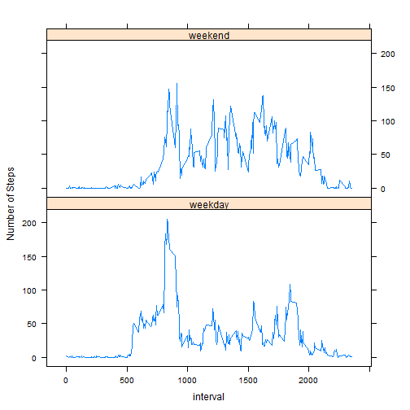

# Reproducible Research
## Assignment 1

The data set for this assigment is activity.csv. The date data is converted from character to Date format.

```r
data <-read.csv("activity.csv")
data[,"date"]<-as.Date(data[,"date"])
```
A histogram of the number of steps taken per day is as follows:


```r
totalPerDay<-tapply(data[,"steps"], data[,"date"], sum, na.rm=T)
hist(totalPerDay, xlab="Steps per Day", main="Steps Per Day")
```

 


```r
meanSteps <- mean(tapply(data[,"steps"], data[,"date"], sum, na.rm=T))
medSteps <- median(tapply(data[,"steps"], data[,"date"], sum, na.rm=T))
```
The mean number of steps taken per day is 9354.2295 and the median is 10395.  

The average number of steps taken for each 5-minute interval, averaged across all days, is presented in the following Time Series plot.

```r
timeMean<-tapply(data[,"steps"], data[,"interval"], mean, na.rm=T)
ts.plot(ts(timeMean), plot.type ="1", ylab="Average Number of Steps", xlab="Time Interval")
```

 

```r
maxSteps<-max(timeMean)
timeMean<-names(timeMean[which.max(timeMean)])
```
The maximum average number of steps that occured in a 5-minute time interval each day was 206.1698 which occured at time interval 835.  


```r
x<-data[,"steps"]
y<-x[!is.na(x)]
missing<-length(x) - length(y)
```
The Activity data set is not complete. There are 2304 missing step values spread across the various time intervals and days.

A new data set is created, called modData, with the NA values replaced by the median number of steps for that time interval taken across all days. For example, any days which are missing the step value for the interval 150 have been replaced by the median number of steps during interval 150 as calculated across all days which had a value for interval 150.


```r
meanStepsInterval <- (tapply(data[,"steps"], data[,"interval"], median, na.rm=T))
x<-which(is.na(data[,"steps"]))
y<-data[x,"interval"]
z<-meanStepsInterval[as.character(y)]
modData<-data
modData[x,"steps"]<-z
```
A histogram of the number of steps taken per day for data set modData is as follows:


```r
totPerDay<-tapply(modData[,"steps"], modData[,"date"], sum)
hist(totPerDay, xlab="Steps per Day", main="Steps Per Day")
```

 


```r
mnSteps <- mean(tapply(modData[,"steps"], modData[,"date"], sum))
mdSteps <- median(tapply(modData[,"steps"], modData[,"date"], sum))
```
The new mean number of steps taken per day is 9503.8689 and the median is 10395.  

The mean for the new data set increased slightly from 9354.2295 to 9503.8689, which would be expected because the missing values were replaced with an interval median, and in the original data set the overall median was above the mean. The median value for the new data set remained the same which was likely the result of how the missing values were distributed across the days. 

The impact to the total daily number of steps was an increase in the daily values, which again makes sense because we replaced missing values which did not add to the total with step values that did add to the total.

Using the new dataset with missing values replaced as described above, the average number of steps per time interval averaged across all days is compared for weekdays versus weekends using two time series plots.


```r
days<-rep("weekday", times=nrow(modData))
library(chron)
wkend<-is.weekend(modData[,"date"])
days[wkend]<-"weekend"
dayFactor<-factor(days)
modData["day"]<-days
intvMean<-tapply(modData[,"steps"], list(modData[,"interval"], modData[,"day"]), mean, na.rm=T)
i<-as.numeric(names(intvMean[,1]))
wkd<-intvMean[,1]
wke<-intvMean[,2]
facD<-rep("weekday", times=nrow(intvMean))
facE<-rep("weekend", times=nrow(intvMean))
DF<-data.frame(intv=i, steps=wkd, fac=facD)
DF2<-data.frame(intv=i, steps=wke, fac=facE)
DF<-rbind(DF, DF2)
library(lattice)
xyplot(DF[,"steps"] ~ DF[,"intv"] | DF[,"fac"], type="l", 
  layout=c(1,2), xlab="interval", ylab="Number of Steps") 
```

 

